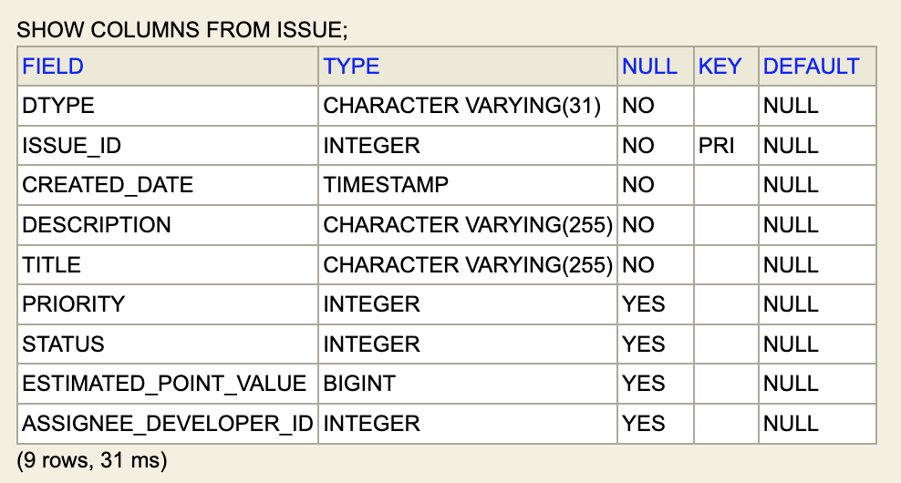
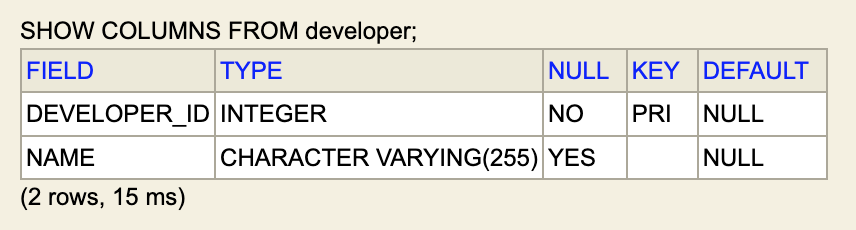
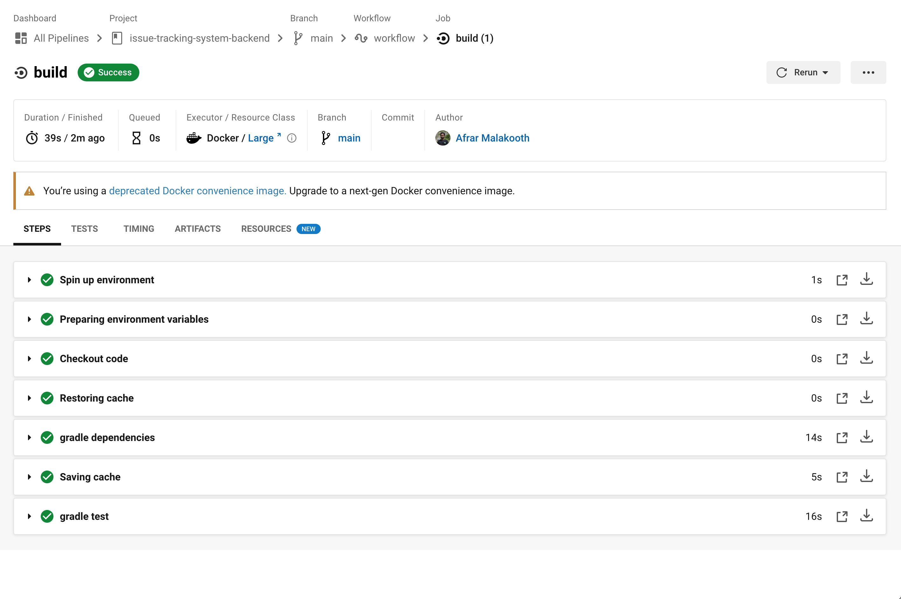

# Issue Tracking System Backend

REST API for an issue tracker for a small team of developers.

## Technical Choices
* Java 8 - Java version which I have working experience with
* Spring Boot 2 - Helps to scaffold a Spring project and manage dependencies
* Gradle - Facilitates easy dependency management with few lines 
* H2 Database - Supports rapid development of prototypes and POCs
* Data JPA - ORM specification which supports Hibernate to interact with database
* Lombok - Used to removed boilerplate code from source code
* Validation API - Serves the purpose of validating the payloads received

## Setup Instructions
1. Clone the repository
   ```
   git clone https://github.com/mmafrar/issue-tracking-system-backend.git
   ```
2. Build the project
   ```
   ./gradlew clean assemble
   ```
3. Run the application
   ```
   java -jar build/libs/issue-tracking-system-backend-0.0.1-SNAPSHOT.jar
   ```
4. Accessing H2 console
   ```
   http://localhost:8080/h2-console
   ```

## Tables
Issue table (issue) and Developer table (developer) are created on start-up.

### Issue Table


### Developer Table


## CircleCI Integration


## REST API Endpoints ([Postman Collection](README/postman-collection.json))
### Create a Developer resource
```
POST /api/v1/developers

{
   "name": "Mohamed Afrar"
}
```
### Retrieve a list of Developers
```
GET /api/v1/developers
```
### Find a Developer resource
```
GET /api/v1/developers/{developerId}
```
### Update a Developer resource
```
PUT /api/v1/developers/{developerId}

{
   "name": "Afrar Malakooth"
}
```
### Delete a Developer resource
```
DELETE /api/v1/developers/{developerId}
```
### Create a Story resource
```
POST /api/v1/stories

{
   "title": "Story Title",
   "description": "Story Description"
}
```
### Retrieve a list of Stories
```
GET /api/v1/stories
```
### Retrieve the plan for Stories
```
GET /api/v1/stories/plan
```
### Find a Story resource
```
GET /api/v1/stories/{issueId}
```
### Update a Story resource
```
PUT /api/v1/stories/{issueId}

{
    "title": "Story Title",
    "description": "Story Description",
    "estimatedPointValue": 5,
    "status": "ESTIMATED"
}
```
### Delete a Story resource
```
DELETE /api/v1/stories/{issueId}
```
### Create a Bug resource
```
POST /api/v1/bugs

{
   "title": "Bug Title",
   "description": "Bug Description",
   "developerId": 11,
   "priority": "MAJOR"
}
```
### Retrieve a list of Bugs
```
GET /api/v1/bugs
```
### Find a Bug resource
```
GET /api/v1/bugs/{issueId}
```
### Update a Bug resource
```
PUT /api/v1/bugs/{issueId}

{
    "title": "Bug Title",
    "description": "Bug Description",
    "developerId": 11,
    "priority": "MAJOR",
    "status": "VERIFIED"
}
```
### Delete a Bug resource
```
DELETE /api/v1/bugs/{issueId}
```
